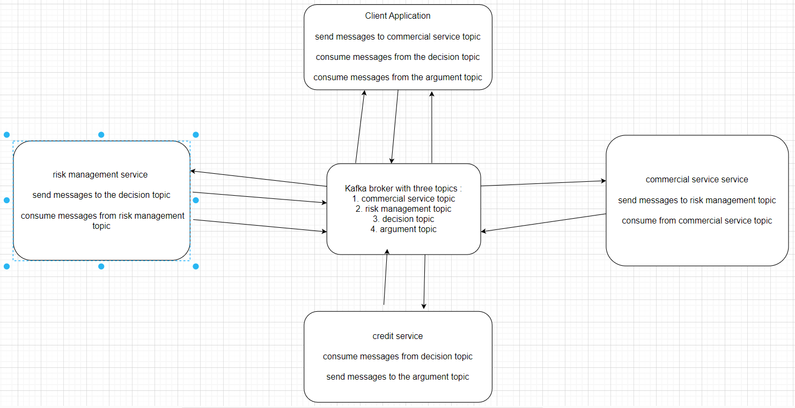

<h2>Hello this is a basic microservices architecture lab that uses messages driven microservices</h2>
<h3>The communication is assured via a kafka broker with 4 topics</h3>

  
<h3>Architecture overview</h3>

  
<h3>Topics overview</h3>
<table>
    <thead>
        <td>
            topic
        </td>
        <td>
            producer
        </td>
        <td>
            consumer
        </td>
</thead>
<tr>
    <td>
        commercial-service
    </td>
    <td>client-service</td>
    <td>commercial-service</td>
</tr>
<tr>
    <td>risk-management-service</td>
    <td>client-service</td>
    <td>risk-management-service</td>
</tr>
<tr>
    <td>decision</td>
    <td>risk-management-service</td>
    <td>client-service and credit-service</td>
</tr>
<tr>
    <td>argument</td>
    <td>credit-service</td>
    <td>client-service</td>
</tr>
</table>
  
<footer><h3>done with love and passion by Mosbahi Firas</h3></footer>